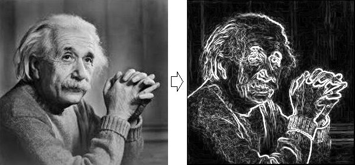
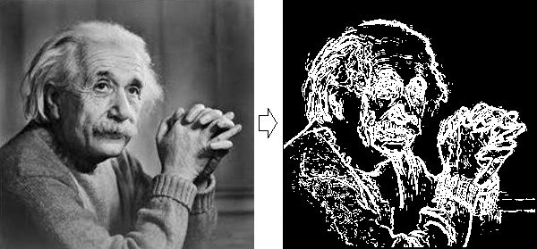

Sobel operator
==============
This is Sobel operator (or Sobel filter) implementation on PHP. It used in image processing and computer vision, particularly within edge detection algorithms.
Read full article in [Wikipedia](https://en.wikipedia.org/wiki/Sobel_operator)

Installation
------------
```bash
composer require qmegas/sobel-operator
```

Requirements
------------
PHP >= 7.0

Usage Examples
--------------
```php
<?php

$sobel = new \Qmegas\SobelOperator();
$image = imagecreatefromjpeg('1.jpg');
header('Content-type: image/png');
imagepng($sobel->applyFilter($image));
```


### Options
| Parameter | Description |
|:-----|:------------|
| `flat` | Enables flat mode |
| `threshold` | Set threshold manually. In case that parameter is not set, algorithm choose threshold automatically |
| `return_threshold` | Return an array of two elements. First one is an image with Sobel filter applied, second element is value of applied threshold |

```php
<?php

$sobel = new \Qmegas\SobelOperator();
$image = imagecreatefromjpeg('1.jpg');
header('Content-type: image/png');
imagepng($sobel->applyFilter($image, [
	'flat' => true,
	'threshold' => 30,
]));
```

